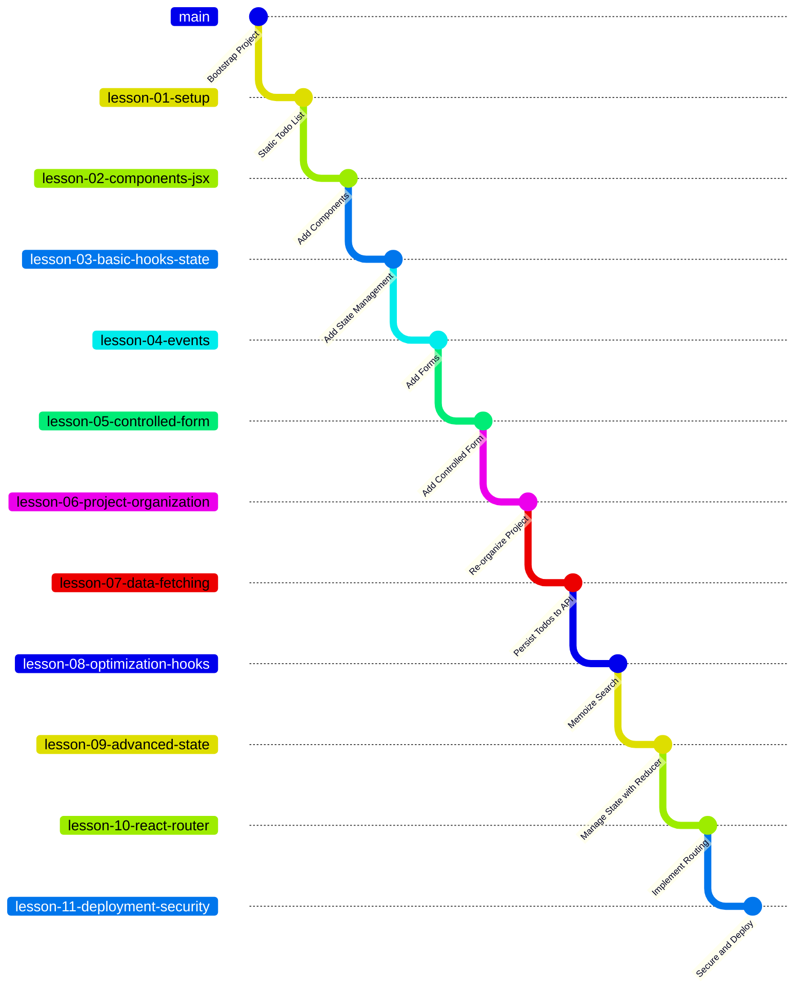

# React Todo List V4 (Work in Progress)

This repo contains an example todo list project that intro to React mentors may use as a reference to evaluate student work. Each branch represents the end state of the student's weekly progress through the curriculum.

## Running this Application

### Prerequisites

- Node.js (version 18 or higher)
- npm
- Git

### Installation

1. Clone the repository
2. Install dependencies
3. Start the development server `npm run dev`
4. Open your browser to `http://localhost:5173`

## Contributing to This Project

### Initial Setup for Contributors

1. **Fork and clone** the repository
2. **Install dependencies**
3. **Make the propagation script executable**

```bash
chmod +x scripts/propagate-changes.sh
```

### Contributor Workflow

1. **Choose your starting lesson** based on what you're working on
2. **Make your changes** on the appropriate lesson branch
3. **Test your changes** locally
4. **Propagate forward** to subsequent lessons:

```bash
./scripts/propagate-changes.sh forward lesson-02-components
```

5. **Review propagated changes** on each affected branch
6. **Create pull requests** for the branches you've modified

### Best Practices for Contributors

- **Start with the earliest lesson** that needs your changes
- **Test thoroughly** before propagating forward
- **Write clear commit messages** that explain the educational purpose
- **Document new concepts** in code comments for student clarity
- **Keep lesson-specific features** isolated to appropriate branches
- **Update README** if you add new concepts or change the structure

### Common Scenarios

#### Adding a New Feature

```bash
# Add feature to the appropriate lesson
git checkout lesson-04-forms
# ... make changes
git commit -m "Add form validation for todo input"

# Propagate to subsequent lessons
./scripts/propagate-changes.sh forward lesson-04-forms
```

#### Fixing a Bug Across All Lessons

```bash
# Fix on earliest affected lesson
git checkout lesson-01-basic
# ... fix bug
git commit -m "Fix accessibility issue in todo checkbox"

# Propagate to all subsequent lessons
./scripts/propagate-changes.sh forward lesson-01-basic
```

#### Updating Shared Components

```bash
# Update on the lesson where component is introduced
git checkout lesson-02-components
# ... update shared component
git commit -m "Improve TextInputWithLabel props interface"

# Propagate forward
./scripts/propagate-changes.sh forward lesson-02-components
```

## Curriculum Management - Linear Branch Strategy

This project uses a **Linear Branch Strategy** for managing curriculum lessons. Each lesson builds incrementally on the previous one, creating a clear learning progression.

### Branch Structure



### Workflow

#### 1. Manual Branch Setup (One Time)

Create lesson branches manually in order:

```bash
git checkout main
git checkout -b lesson-01-basic

git checkout main
git checkout -b lesson-02-components

# Continue for each lesson...
```

#### 2. Update the Propagation Script

Edit the `LESSONS` array in `scripts/propagate-changes.sh` with your actual branch names:

```bash
LESSONS=("main" "lesson-01-basic" "lesson-02-components" "lesson-03-state" ...)
```

#### 3. Daily Development Workflow

```bash
# Make changes on any lesson branch
git checkout lesson-02-components
# ... make your changes
git add .
git commit -m "Add TodoForm component"

# Propagate forward to all subsequent lessons
./scripts/propagate-changes.sh forward lesson-02-components
```

### Available Commands

```bash
# Propagate changes forward from a specific lesson
./scripts/propagate-changes.sh forward lesson-02-components

# Show status of all lesson branches
./scripts/propagate-changes.sh status

# Show help and usage information
./scripts/propagate-changes.sh help
```

### How It Works

The propagation script:

1. **Validates** all branches exist before starting
2. **Merges forward** from your starting lesson through all subsequent lessons
3. **Stops on conflicts** and provides clear next steps
4. **Shows progress** with colored output
